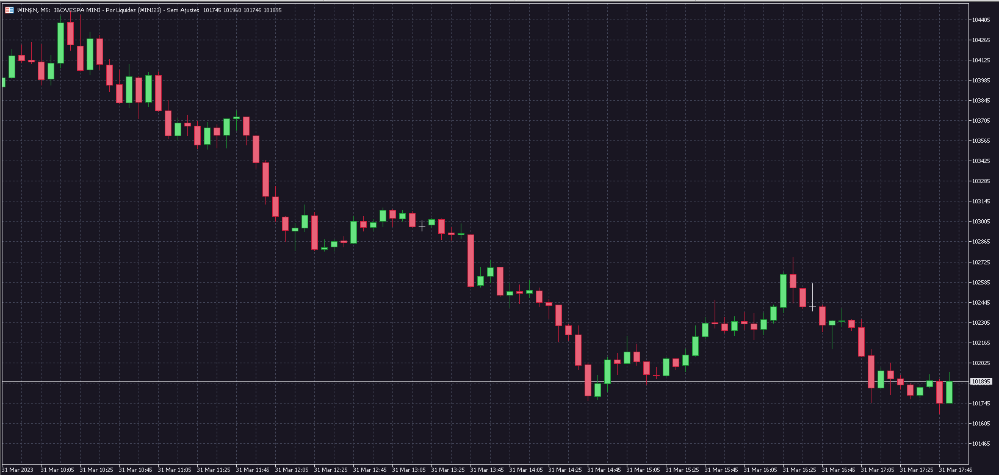

# Omni for [Meta Trader 5](https://www.metatrader5.com/)

## Install

#### Install using Git

If you are a git user, you can install the theme and keep up to date by cloning the repo:

    git clone https://github.com/filipelperes/Omni-MetaTrader5.git

#### Install manually

Download using the [GitHub .zip download](https://github.com/filipelperes/Omni-MetaTrader5/archive/main.zip) option and unzip them.

#### Activating theme

1. In MetaTrader 5, right-click
2. Select "templates"
3. Load template
4. Select the file `Omni.tpl`

## [contributors](https://github.com/filipelperes/Omni-MetaTrader5/graphs/contributors)

|  |
| -------------------------------------------------------------------------------------------------------- |
| [filipelperes](https://github.com/filipelperes)                                                             |